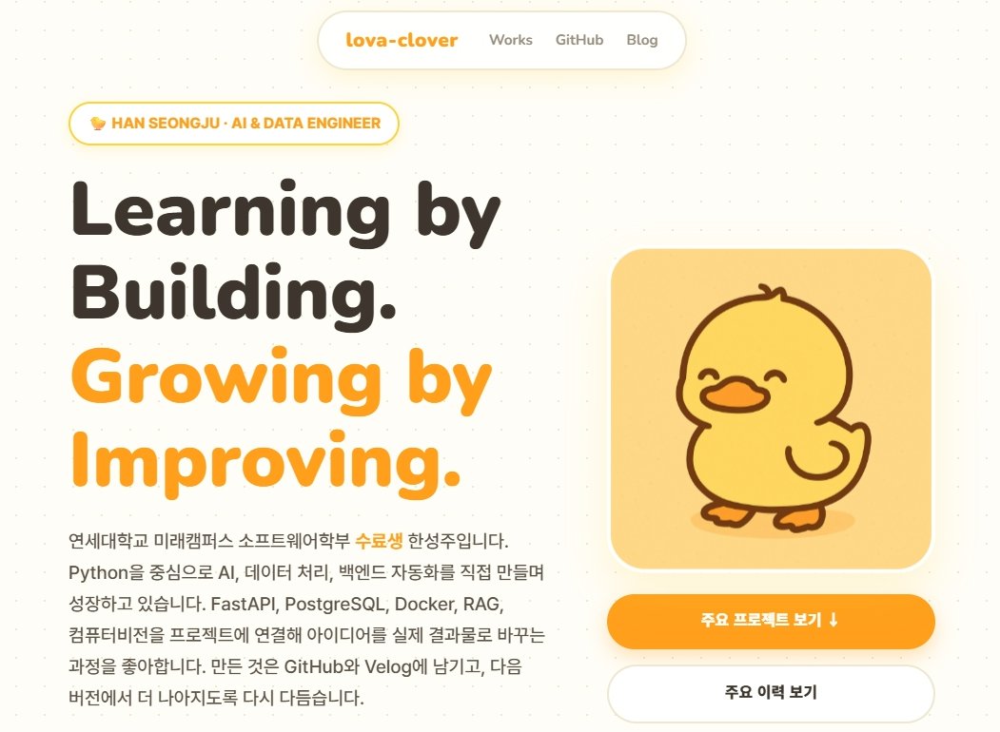

# lova-clover.github.io

<div align="center">

### Learning by Building. Growing by Improving.

한성주의 개인 포트폴리오 웹사이트입니다.  
AI, 데이터, 백엔드, 자동화를 직접 만들고 기록하며 성장하는 과정을 담았습니다.

[](https://lova-clover.github.io/)

[Portfolio](https://lova-clover.github.io/) • [GitHub](https://github.com/Lova-clover) • [Velog](https://velog.io/@lova-clover/posts)

</div>

---

## About

이 저장소는 프로젝트 결과물만 모아둔 페이지가 아니라,  
"직접 만들고, 개선하고, 다시 기록하는 개발자"라는 방향성이 드러나도록 구성한 포트폴리오입니다.

사이트에서는 다음 내용을 중심으로 보여줍니다.

- AI & Data Engineer로서의 정체성
- 문제를 구현까지 연결하는 방식
- 대표 프로젝트와 기술 스택
- 대회, 실험, 기록을 포함한 성장 흐름

## Highlights

- `Selected Works`: DevHistory, MediBridge, PerfactoAI, AnemiaDetection, FreshGuard, CheckmateAI
- `Applied Highlights`: 짧은 기간 안에 문제를 정의하고 결과까지 만든 작업들
- `History & Records`: 프로젝트, 대회, 실험, 기록이 이어지는 성장 흐름

## Stack

```text
HTML
CSS
Vanilla JavaScript
GitHub Pages
```

## Links

- Portfolio: https://lova-clover.github.io/
- GitHub: https://github.com/Lova-clover
- Velog: https://velog.io/@lova-clover/posts

---

<div align="center">

만들고, 기록하고, 다음 버전으로 계속 개선합니다.

</div>
