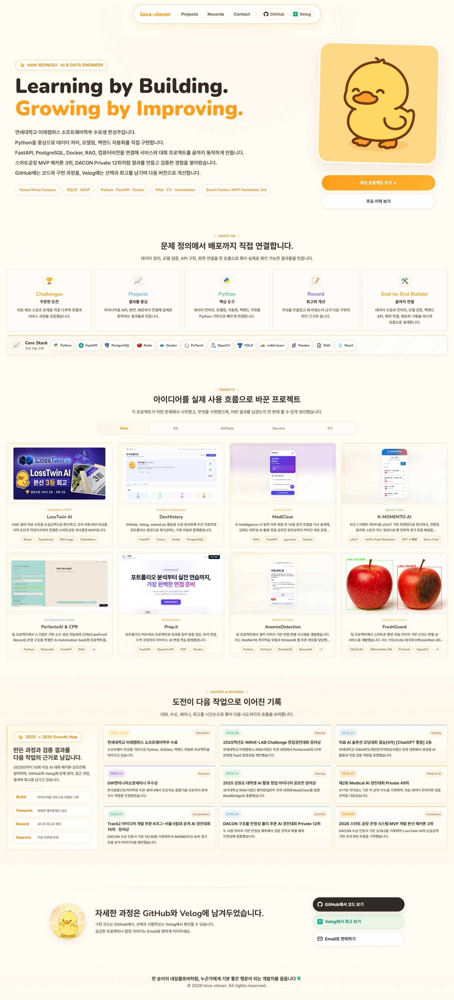

# lova-clover.github.io

<div align="center">

## Learning by Building. Growing by Improving.

한성주의 개인 포트폴리오 웹사이트입니다.  
AI, 데이터 처리, 백엔드 자동화, 컴퓨터비전 프로젝트를 실제 결과물과 기록 중심으로 정리했습니다.

[Portfolio](https://lova-clover.github.io/) · [GitHub](https://github.com/Lova-clover) · [Velog](https://velog.io/@lova-clover/posts)

[](https://lova-clover.github.io/)

</div>

---

## Overview

이 저장소는 GitHub Pages로 배포되는 단일 페이지 포트폴리오입니다.

프로젝트를 단순히 나열하기보다, 각 작업이 어떤 문제에서 시작했고 어떤 구현으로 이어졌으며 어떤 결과와 회고를 남겼는지 한 화면에서 확인할 수 있도록 구성했습니다.

## Highlights

- 따뜻한 크림/오렌지 톤과 오리 캐릭터를 중심으로 한 개인 브랜딩
- Main 프로젝트 8개와 전체 프로젝트/기록을 볼 수 있는 갤러리 구조
- 프로젝트별 이미지 슬라이드, 역할, 핵심 구현, 결과, GitHub/Velog 링크
- 대회, 수상, 세미나, 회고를 시간순으로 정리한 History & Records
- 데스크톱과 모바일을 모두 고려한 반응형 레이아웃

## Featured Projects

| Project | Focus | Summary |
| --- | --- | --- |
| LossTwin AI | Smart Factory · MVP | CNC 설비 이상 신호를 손실금액, ROI 비교, 승인/작업지시 흐름으로 연결한 MVP |
| DevHistory | Automation · Archive | GitHub, Velog, solved.ac 활동을 수집해 리포트와 포트폴리오 증빙으로 재가공 |
| MediClear | Medical Ops · RAG | 퇴원 후 14일 관리 흐름을 안내문, 알림, 위험신호 기록 구조로 확장 |
| K-MOMENTO AI | Sports Data | K리그 이벤트 데이터를 xG/xT 모멘텀, 전환점 탐지, 스토리 카드로 전환 |
| PerfactoAI & CPR | AI Automation SaaS | 쇼츠 생성 자동화와 CareProof Record 운영 로그 구조를 연결 |
| Prep.it | AI Interview | 포트폴리오 PDF 기반 맞춤 질문, 모의 면접, 누적 코칭 흐름 구현 |
| AnemiaDetection | Medical Vision | ResNet18 기반 결막 이미지 빈혈 판별 모델과 Streamlit 추론 데모 구현 |
| FreshGuard | Computer Vision | YOLOv8n ROI 탐지와 EfficientNet-B0 분류를 연결한 과일 신선도 판별 파이프라인 |

## Records

- 2025학년도 WAVE-LAB Challenge 창업경진대회 장려상
- 의료 AI 솔루션 코딩대회 결승(5차) [ChatGPT 활용] 2등
- SW엔지니어소양세미나 우수상
- 2025 강원도 대학생 AI 활용 창업 아이디어 공모전 장려상
- 제2회 Medical AI 경진대회 Private 49위
- Track2 아이디어 개발 부문 K리그-서울시립대 공개 AI 경진대회 15위 및 장려상
- DACON 구조물 안정성 물리 추론 AI 경진대회 Private 12위
- 2026 스마트 공장 운영 시스템 MVP 개발 본선 해커톤 3위

## Stack

사이트 자체는 별도 빌드 도구 없이 정적 파일로 구성했습니다.

```text
HTML
CSS
Vanilla JavaScript
GitHub Pages
```

포트폴리오에서 반복적으로 다룬 주요 기술은 다음과 같습니다.

```text
Python · FastAPI · PostgreSQL · Redis · Docker
PyTorch · OpenCV · YOLO · scikit-learn · Pandas
RAG · React
```

## Structure

```text
.
├── index.html
├── assets/
│   ├── emoji/
│   ├── icons/
│   └── project images
├── LICENSE
├── NOTICE.md
└── README.md
```

`index.html` 하나로 동작하는 정적 포트폴리오이며, 현재 `assets`에는 실제 페이지에서 참조하는 파일만 남겨두었습니다.

## Local Preview

별도 설치 없이 `index.html`을 브라우저에서 열면 확인할 수 있습니다.

```text
index.html
```

## Deployment

GitHub Pages에서 저장소 루트의 `index.html`을 배포합니다.

```text
Repository Settings -> Pages -> Deploy from branch -> main / root
```

## License

Source code files are licensed under the [MIT License](LICENSE).

Portfolio content, project screenshots, images, personal branding, and written
materials are not covered by the MIT License. See [NOTICE.md](NOTICE.md) for
details.

---

<div align="center">

한 송이의 네잎클로버처럼, 누군가에게 기분 좋은 행운이 되는 개발자를 꿈꿉니다. 🍀

</div>
