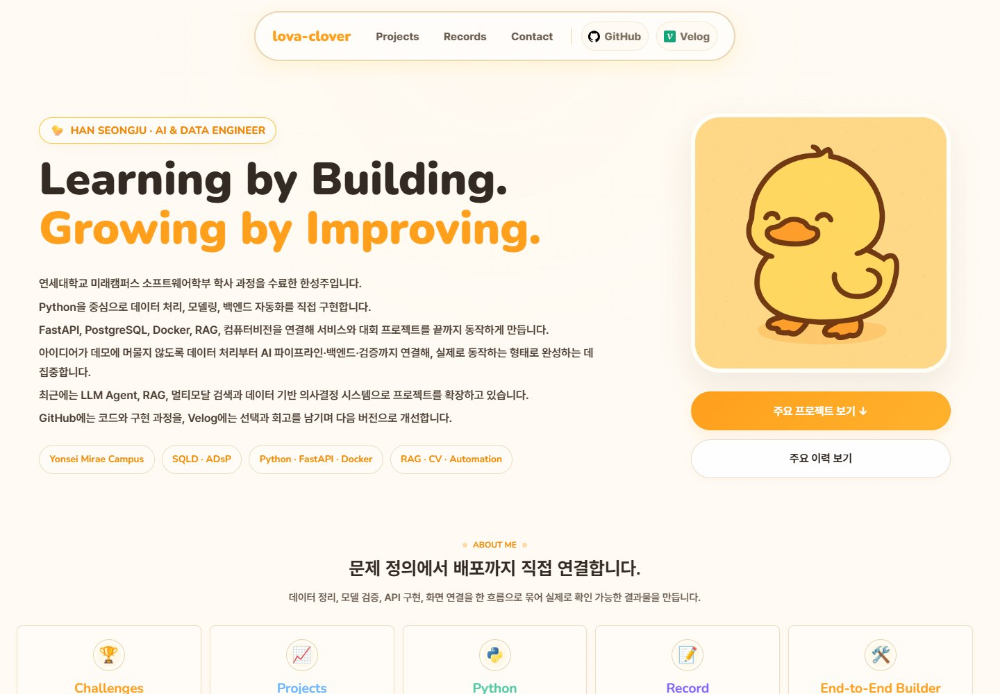

<div align="center">

# Han Seongju · Lova-clover

**문제를 좁히고, 데이터와 AI를 연결해, 동작하는 서비스로 만듭니다.**

AI / Data Engineering · Backend Automation · Computer Vision

[포트폴리오](https://lova-clover.github.io/) · [GitHub](https://github.com/Lova-clover) · [개발 기록](https://velog.io/@lova-clover/posts) · [Email](mailto:woeg0226@naver.com)

<a href="https://lova-clover.github.io/">
  <picture>
    <source media="(prefers-color-scheme: dark)" srcset="assets/portfolio-preview-2026-dark.jpg">
    
  </picture>
</a>

</div>

## 소개

Python을 중심으로 데이터 처리, 모델링, 백엔드 자동화를 구현합니다. 최근에는 LLM 응답의 근거 검증, RAG, 멀티모달 검색과 데이터 기반 의사결정 서비스를 만들고 있습니다.

이 저장소에는 프로젝트의 **문제 · 구현 · 역할 · 결과**를 보여주는 포트폴리오 웹사이트가 담겨 있습니다. 실제 서비스 화면과 발표자료를 함께 볼 수 있고, 공개된 코드·데모·회고는 각 프로젝트 상세에서 연결됩니다.

## 대표 프로젝트

| 순서 · 프로젝트 | 해결한 문제와 구현 | 결과 / 확인할 수 있는 작업 |
| --- | --- | --- |
| **01 · 겹봄 (GyeopBom)** | 돌봄·근무 일정 충돌 이후의 행동을 CARE → TIME → DIRECT로 안내. 공유 EVENT 상태와 예약 문자 로컬 파서를 연결했습니다. | 호남 IS 코딩챌린지 **대상·전주시장상**. 현장 10시간 동안 1인 구현한 프로토타입 |
| **02 · 첫자리** | 가게 계약 전 시작 자금·손익분기 주문 수·감당 가능한 월세를 점검. 비용 계산 엔진과 LLM 설명을 분리하고 규칙 기반 fallback을 구성했습니다. | 경기도 공공데이터 AI 활용 창업경진대회 **장려상**. 예선 315팀 중 본선 9팀 |
| **03 · LossTwin AI** | CNC 설비 이상을 손실금액으로 환산하고 조치 비용·ROI·승인·작업지시까지 연결한 스마트공장 MVP입니다. | 스마트 공장 운영 시스템 MVP 개발 **본선 해커톤 3위** |
| **04 · PerfactoAI & CPR** | RAG·영상 생성·FFmpeg 합성과 링크/QR 배포, 동의·열람·이수 이벤트 기록을 연결했습니다. | **WAVE-LAB Challenge 장려상**. 팀 프로젝트 개발 파트 담당 |
| **05 · MediClear** | 퇴원 후 14일의 안내·상태 관리 흐름에 RAG 안내문, 알림, 설문, 위험신호 관리를 구성했습니다. | 강원도 대학생 AI 활용 창업 아이디어 공모전 **장려상**, K-Intelligence Track 2 본선 진출 |
| **06 · 찍먹AI** | 음식 사진의 멀티모달 분석 → Oracle Vector Search 후보 검색 → 속성 재정렬 → 메뉴·옵션 선택 흐름을 구현했습니다. | 요기요 × 오라클 해커톤 **서류 지원 186팀 중 본선 8팀 선정** |
| **07 · AnemiaDetection** | 결막 이미지 기반 ResNet18 전이학습을 수행하고 Streamlit 추론 화면으로 연결했습니다. | 5-Fold CV 검증과 웹 데모. 팀 프로젝트의 모델 학습·추론 데모 담당 |
| **08 · FreshGuard** | YOLOv8n 탐지 ROI와 EfficientNet-B0 멀티태스크 분류를 연결해 과일 종류·신선도를 판별했습니다. | 팀 프로젝트의 AI 모델 개발·CV 파이프라인 담당. 상세에 검증 조건과 결과 수록 |

Main은 기본 8개입니다. 화면이 넓어 실제 그리드가 5열이 되면 **K-MOMENTO AI → DevHistory**를 추가해 두 행으로 보여줍니다. All은 같은 순서로 시작하며 RISK:REHEARSE, PortFlow Dispatch AI, MoveLens, TwinOps Ulsan 등을 포함한 **23개 프로젝트**를 제공합니다.

All에는 저장소 근거를 검증하는 개발 도구 **RepoDNA**, 공개 URL의 기본 보안 설정을 점검하는 **SiteGuard**, Stockfish 기반 체스 훈련 플랫폼 **CheckmateAI**, 기록·재생 퍼즐 게임 **Afterimage-Runner**를 추가했습니다. RepoDNA의 고정 데모와 실제 분석 모드, SiteGuard의 패시브 점검 범위는 상세에서 구분합니다.

대회 수상은 **History & Records**, 본선 진출·발표 기록은 **Finalist & Selected**에서 구분합니다. 자체 평가 결과는 공식 대회 성적과 구별하며, 프로젝트별 역할과 프로토타입의 한계도 상세에 함께 적었습니다.

## 프로젝트에서 사용한 기술

| 영역 | 실제 프로젝트에 사용한 기술 |
| --- | --- |
| AI · 검색 | RAG, OpenAI Responses API, OCI Gemini, Cohere Embed 4, Oracle Vector Search, pgvector |
| 데이터 · 컴퓨터비전 | Python, Pandas, scikit-learn, PyTorch, OpenCV, YOLOv8n, ResNet18, EfficientNet-B0 |
| 백엔드 · 자동화 | FastAPI, Node.js, Fastify, PostgreSQL, Redis, Celery, Docker, FFmpeg |
| 서비스 화면 | React, Next.js, TypeScript, Vanilla JavaScript, Streamlit, PWA, Chart.js |

이 표는 여러 프로젝트에서 사용한 기술을 모은 것입니다. 개별 프로젝트의 적용 범위는 해당 상세 설명을 기준으로 합니다.

## 포트폴리오 구현

웹사이트 자체는 **HTML · CSS · Vanilla JavaScript**로 만든 정적 페이지입니다. Node.js 기본 모듈로 검사·빌드·로컬 서버를 제공하며, 실행을 위해 별도 npm 패키지를 설치할 필요가 없습니다.

- **콘텐츠와 화면 분리** — 프로젝트·수상·본선 기록·역할을 `assets/data/portfolio.js`에서 관리합니다.
- **확장 가능한 갤러리** — 카테고리 필터, 이미지 슬라이드, 키보드·터치 조작을 지원합니다. 카드 태그는 한 줄에 맞춰 `+N`으로 요약하고 상세에는 전체를 표시합니다.
- **일관된 표현** — 오리 캐릭터와 크림·오렌지 색상, 같은 카드 구조를 유지합니다. 시스템 다크 모드와 화면 크기에 대응합니다.
- **읽기와 이동** — 모바일 메뉴, 상세창 포커스 순환·복귀, Escape 닫기, 모션 감소 설정을 지원합니다.
- **보존 검사** — 기존 프로젝트 콘텐츠, 중복, 대표 순서, 모든 프로젝트의 역할, 이미지 경로와 외부 링크 속성, 공유 메타데이터를 빌드 전에 확인합니다.
- **이미지와 공유** — Hero는 우선 로드하고 카드·갤러리는 지연 로딩합니다. 전용 파비콘, canonical·OG·Twitter 카드, ProfilePage JSON-LD, robots·sitemap·404 페이지를 제공합니다.

## 로컬 실행

**Node.js 18 이상**이 필요합니다.

```bash
git clone https://github.com/Lova-clover/Lova-clover.github.io.git
cd Lova-clover.github.io
npm run dev
```

브라우저에서 **http://127.0.0.1:4175/** 를 엽니다.

| 명령 | 동작 |
| --- | --- |
| `npm run dev` | 소스 기반 로컬 미리보기 · 포트 4175 |
| `npm run check` | 데이터·역할·순서·이미지·링크·공유 정보·기존 콘텐츠 보존 검사 |
| `npm run build` | 검증 후 `dist/`에 정적 페이지·리소스·라이선스 고지 생성 |
| `npm run preview -- --port 4176` | 빌드 결과를 별도 포트에서 미리보기 |

로컬 서버는 공개 HTML·`assets/`·`robots.txt`·`sitemap.xml`만 제공합니다. 알 수 없는 경로는 404 상태와 안내 페이지를 반환하며 archive·개발 파일은 제공하지 않습니다. 검사·빌드는 인터넷 연결이나 API 키 없이 실행됩니다. 웹폰트와 프로젝트의 외부 링크를 열 때는 네트워크 연결이 필요합니다.

## 파일 구조

```text
.
├── index.html                   # 페이지 구조 · 기본 스타일 · 상호작용
├── 404.html · robots.txt · sitemap.xml
├── .github/workflows/portfolio-qa.yml # Node 20 check/build 자동 검증
├── assets/
│   ├── data/portfolio.js         # 프로젝트 · Records · Finalist · 역할
│   ├── projects/                # 실제 서비스 화면과 발표 이미지
│   ├── styles/refinement.css    # 세부 레이아웃 · 반응형 · 다크 테마
│   ├── icons/ · emoji/          # UI 리소스
│   └── licenses/                # 외부 리소스 출처와 라이선스 원문
├── scripts/
│   ├── check.mjs                # 콘텐츠 검사
│   ├── publishing-checks.mjs    # 역할 · SEO · 정적 파일 · 이미지 용량 검사
│   ├── build.mjs                # 정적 산출물 생성
│   ├── serve.mjs                # 로컬 서버
│   └── fixtures/                # 기존 프로젝트 보존 기준
├── _config.yml                  # GitHub Pages 배포 제외 경로
├── LICENSE                      # 구현 코드: MIT
└── NOTICE.md                    # 콘텐츠·브랜딩·외부 자료의 사용 범위
```

3D 실험은 로컬 `archive/3d-experiments/`에 보존하며 Git과 배포에서 제외합니다. 로컬 자료 확인 문서·스크린샷 검사 결과·빌드 출력도 커밋하지 않습니다. 콘텐츠 검사에 필요한 기준 데이터는 `scripts/fixtures/`에 포함하므로 새로 clone한 환경에서도 검사와 빌드가 가능합니다.

## 프로젝트 추가와 수정

1. 실제 프로젝트 이미지나 발표자료를 `assets/projects/<id>/`에 넣습니다.
2. `assets/data/portfolio.js`에 고유한 `id`, 설명, 기술, 이미지, 확인된 링크와 결과를 작성합니다. 카드의 짧은 소개는 `summary`, 상세 설명은 `desc`를 사용합니다. 같은 `id`로 `projectRoles`의 `mode`, `label`, `contribution`, 비어 있지 않은 `tasks` 배열도 반드시 작성합니다.
3. `categories`로 분류하고 `rank`로 순서를 정합니다. 대표 8개는 `main`, 5열에서 추가할 2개는 `main-wide`로 구분합니다. 대표 구성을 바꾸면 `scripts/check.mjs`의 기대 순서도 함께 수정합니다.
4. `records`에는 수상·주요 이력을, `finalists`에는 본선 기록을 작성합니다. 수상·본선 날짜는 `YYYY.MM`로 통일하고 오래된 기록부터 배치합니다. 본선은 `date`에 실제 발표·결과 월을, `detail`에 대회명 아래에 표시할 세부 기록을 작성합니다.
5. `npm run build` 후 모바일·데스크톱과 라이트·다크 테마에서 카드와 상세창을 확인합니다.

자료가 없는 항목은 성과·기술·링크를 추정해 채우지 않습니다. 실제 화면이 준비되지 않았다면 `cover: null`, `media: []`, `mediaStatus: "awaiting-source"`를 사용할 수 있습니다. 상세 데이터의 형식은 기존 프로젝트 항목을 참고하세요.

## 검증과 배포

빌드 검사에 더해 브라우저에서 전체 프로젝트 상세·이미지, 필터, 갤러리, 모바일 메뉴, 키보드 이동을 확인합니다. 화면 폭 320~2400px의 라이트·다크 테마를 점검했으며, 이는 Chromium 에뮬레이션 기준입니다. 실기기·다른 브라우저 확인은 별도입니다.

GitHub Actions의 `Portfolio QA`는 main 대상 push·pull request에서 Node 20으로 check/build를 실행합니다. 별도 패키지 설치가 필요 없으며, Pages 배포를 대체하거나 배포 완료를 보장하는 workflow는 아닙니다.

GitHub Pages는 `main`의 루트에서 배포합니다. `index.html`과 신규 데이터·스타일·이미지를 함께 커밋하고 푸시해야 합니다. `_config.yml`은 archive·개발 스크립트·작업 문서를 공개 사이트에서 제외합니다. 외부 호스팅에 올릴 때는 `npm run build`의 `dist/`를 사용할 수 있습니다.

프로젝트 데모는 각각 별도로 운영됩니다. Streamlit 등 외부 서비스는 휴면이나 API 설정에 따라 첫 실행 상태가 달라질 수 있습니다.

## 라이선스와 연락

**구현 코드는 [MIT](LICENSE)**로 공개합니다. 개인 소개·프로젝트 글·스크린샷·발표자료·브랜딩은 별도 범위이며, 코드 라이선스가 해당 콘텐츠의 재사용까지 허용하는 것은 아닙니다. 자세한 내용은 [NOTICE](NOTICE.md)와 [외부 리소스 고지](assets/licenses/README.md)를 확인해 주세요.

프로젝트나 협업에 관한 연락은 [Email](mailto:woeg0226@naver.com)로 받을 수 있습니다. 구현 과정과 시행착오는 [Velog](https://velog.io/@lova-clover/posts)에 남깁니다.

---

<div align="center">

한 송이의 네잎클로버처럼, 누군가에게 기분 좋은 행운이 되는 개발자를 꿈꿉니다. 🍀

</div>
